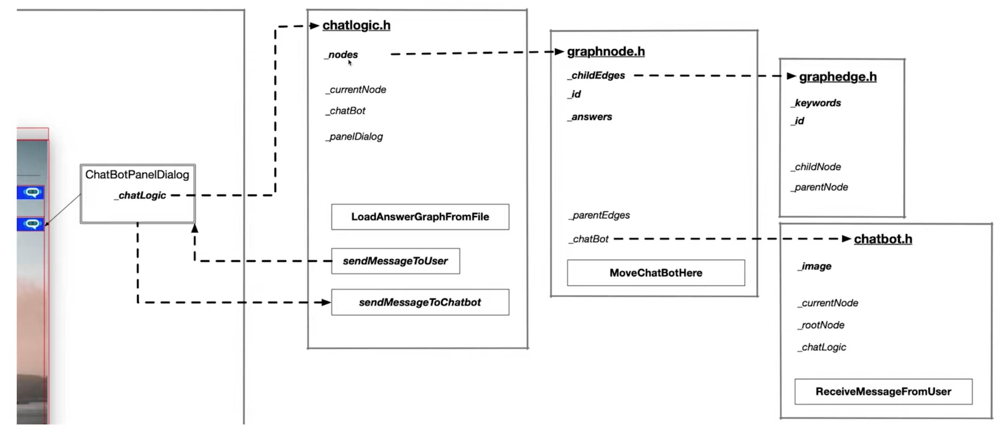

# Memory Management Chatbot

The ChatBot code creates a dialogue where users can ask questions about some aspects of memory management in C++. After the knowledge base of the chatbot has been loaded from a text file, a knowledge graph representation is created in computer memory, where chatbot answers represent the graph nodes and user queries represent the graph edges. After a user query has been sent to the chatbot, the Levenshtein distance is used to identify the most probable answer.

This project implements a more efficient memory management model using smart pointers, move semantics and exclusive ownership of objects based on this [starter code](https://github.com/udacity/CppND-Memory-Management-Chatbot), and in accordance with this [rubric](https://review.udacity.com/#!/rubrics/2687/view).

  

## Dependencies for Running Locally
* cmake >= 3.11
  * All OSes: [click here for installation instructions](https://cmake.org/install/)
* make >= 4.1 (Linux, Mac), 3.81 (Windows)
  * Linux: make is installed by default on most Linux distros
  * Mac: [install Xcode command line tools to get make](https://developer.apple.com/xcode/features/)
  * Windows: [Click here for installation instructions](http://gnuwin32.sourceforge.net/packages/make.htm)
* gcc/g++ >= 5.4
  * Linux: gcc / g++ is installed by default on most Linux distros
  * Mac: same deal as make - [install Xcode command line tools](https://developer.apple.com/xcode/features/)
  * Windows: recommend using [MinGW](http://www.mingw.org/)
* wxWidgets >= 3.0
  * Linux: `sudo apt-get install libwxgtk3.0-dev libwxgtk3.0-0v5-dbg`
  * Mac: There is a [homebrew installation available](https://formulae.brew.sh/formula/wxmac).
  * Installation instructions can be found [here](https://wiki.wxwidgets.org/Install). Some version numbers may need to be changed in instructions to install v3.0 or greater.

## Basic Build Instructions

1. Clone this repo.
2. Make a build directory in the top level directory: `mkdir build && cd build`
3. Compile: `cmake .. && make`
4. Run it: `./membot`.

## Code schematics

### Gui setup

  

### Class structure

  

### Chatbot motion

The chatbot is moving from node to node depending on user questions and keywords that are sotred within the graph edges.

  
  

